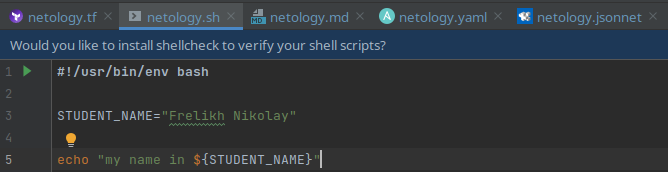

Задание №1 - Подготовка рабочей среды:

- Terraform: 
 
 

- Bash: 

- Markdown: 

- Yaml: 

- Jsonnet: 

Задание №2 - Описание жизненного цикла задачи (разработки нового функционала):

По полученным задачам от клиентов и результатам мониторинга текущей версии продукта разрабатывается новый код и новая версия (дополнения) продукта. Новый продукт проходит тестирование. Новый продукт показывается менеджерам для того чтобы оценить, а то ли хотел заказчик. Дальше продукт отдается заказчику, а также производится постоянный мониторинг работы продукта на предмет ошибок, простоев, сбоев и т.п. По полученным данным от мониторинга и обратной связи клиентов принимается решение о дальнейшим изменении продукта.

Жизненный цикл DevOps:
•	Разработка
•	Интеграция 
•	Тестирование
•	Мониторинг
•	Обратная связь
